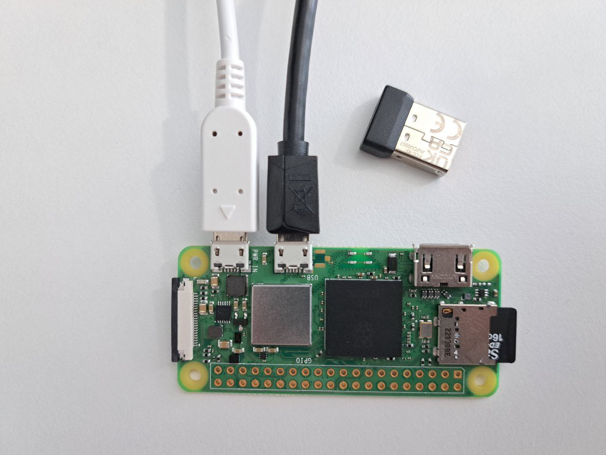
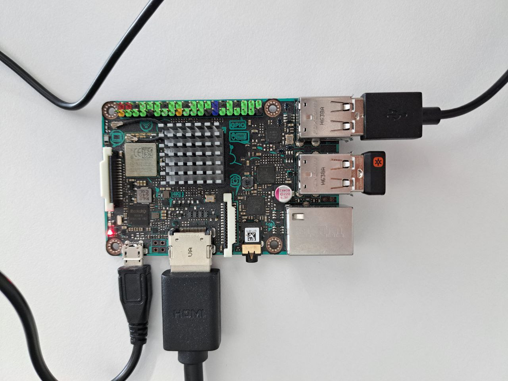
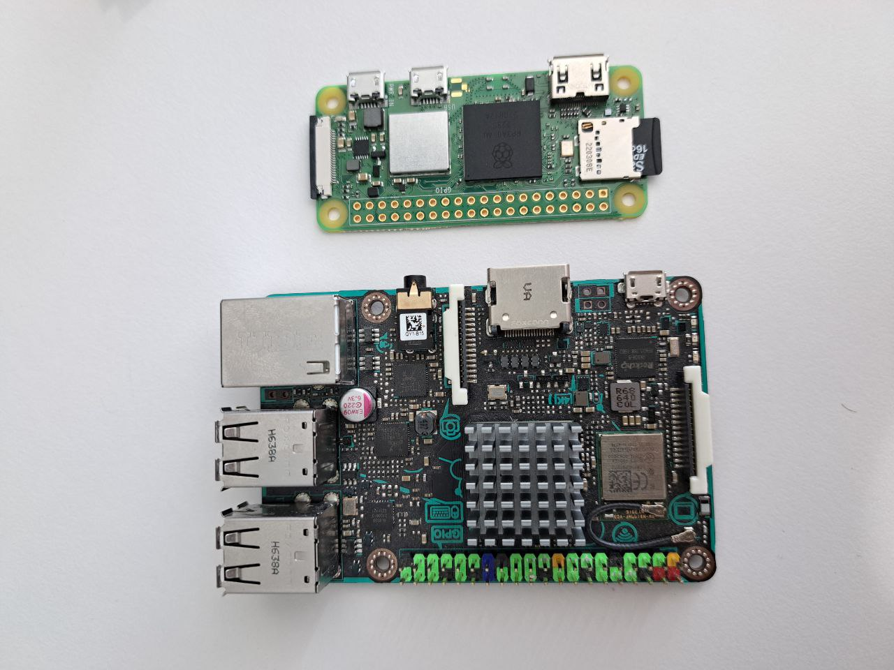
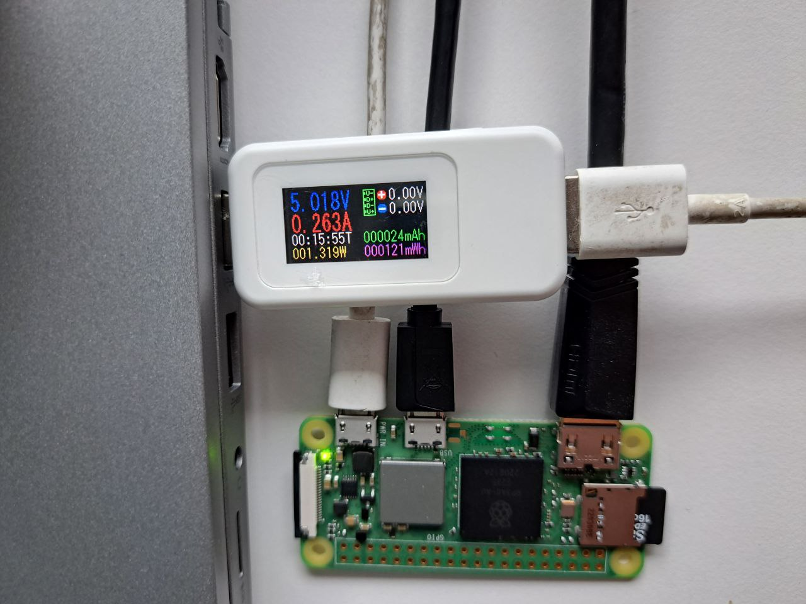

# zRA: Proofs of Attestation based on zkSNARKs  [](https://zenodo.org/badge/latestdoi/624406789)
<p align="center">
  
  <em>The image is made by Bing Image Creator (Powered by DALL·E 3)</em>
</p>

This repository is an implementation of zRA protocol, a non-interactive method for constructing a transparent remote attestation (RA) protocol based on zkSNARKs. 

This protocol eliminates the need for online and trusted services during attestation. The protocol provides a publicly verifiable attestation mechanism with generating ZK proofs for pre-image solutions for commitments within a specialized Merkle tree. In other words, zRA requires the device (prover) to demonstrate knowledge of specific values (challenge, response, and public_key) that when combined and hashed, result in a leaf within the Merkle tree. In practice, this approach can be viewed as an adaptation of the Tornado-cash protocol to enhance remote attestation.

## References
The initial paper of this protocol has been accepted/published as part of the [NDSS'24](https://www.ndss-symposium.org/ndss2024/) Conference.</br>
For more details on the building blocks, performance and security analysis of zRA, we advise you to check the manuscript, available at NDSS'24.

**Title:** [From Interaction to Independence: zkSNARKs for Transparent and Non-Interactive Remote Attestation](https://www.ndss-symposium.org/ndss2024/)</br>
**Authors:** [Shahriar Ebrahimi](https://lovely-necromancer.github.io), [Parisa Hassanizadeh](https://parizad1188.github.io)</br>
**Conference:** [NDSS 2024](https://www.ndss-symposium.org/ndss2024/)


## Benchmarking
All of the experiments are __reproducible on commodity hardware__ using __Linux__-based operating systems. We have provided pre-built executable/binary files in the repository that can be used easily for benchmarking.

All of the benchmarks are also have been done successfully on the following tiny boards:
1. ASUS TinkerBoard
2. Raspberry Pi Zero 2W
<p float="left">
 
 
 
 
</p>

### Setup/Installation

The only preparation that is required to execute benchmarks is installing "node js and snarkjs package" that can be done in any OS easily as follows:

__For Installing Node JS:__

``` curl -o- https://raw.githubusercontent.com/nvm-sh/nvm/v0.39.3/install.sh | bash ```

``` source ~/.bashrc ```

``` nvm install v16.20.0 ```

> [!NOTE]
> in rare cases (miss-configured Linux distros), if you got an error stating that version "v16.20.0" was not found; following command might help:
> ``` export NVM_NODEJS_ORG_MIRROR=http://nodejs.org/dist ```
> 

__For installing snarkjs:__

``` npm install -g snarkjs ```


### Execution
1. clone the repository with following command:\
```git clone git@github.com:zero-savvy/zk-remote-attestation.git ```

2. go to the benchmark directory:\
```cd zk-remote-attestation/benchmarking ```

3. We have prepared a script for benchmark. Simply give it execution permissions:\
 ```chmod +x script.sh ```

4. Run the benchmarks! \
The script takes two inputs: 1) number of tests, and 2) the test name [choose from ```ra10``` , ```ra20```, ```ra30```, and ```ra40```].

__Example 1__: running proofs of attestation tree with height of __30__ for __10__ times:\
```./script.sh 10 ra30```

__Example 2__: running proofs of attestation tree with height of __20__ for __5__ times:\
```./script.sh 5 ra20```

__Sample output__: The script reports the average time for generating witness and the proof. Below is a sample output:
>Average witness generation time: 0.4152 seconds\
Average proof generation time: 0.7881 seconds

> [!NOTE]
> Please note that depending on the system, generating witnesses and proofs can take time. since the generation times are usually consistent, we suggest trying the benchmark with small number of tests (e.g. 5 or 10) before running higher number of tests.

## References
[1] [Circom](https://github.com/iden3/circom): For building and compiling ZK circuits.

[2] [CircomLib](https://github.com/iden3/circomlib): Used for globaly tested POSEIDON implementations on Circom.

[3] [Tronado-Core](https://github.com/tornadocash/tornado-core): Used for audited implementations of MerkleTree proofs on Circom.

[4] [Circom-compatible POSEIDON implementation in JavaScript](https://github.com/BigWhaleLabs/poseidon): Shoutout to [@BigWhaleLabs](https://github.com/BigWhaleLabs) for the accurate implementation of POSEIDON that is compatible with CircomLib.

## License
<p xmlns:cc="http://creativecommons.org/ns#" >This work is licensed under <a href="http://creativecommons.org/licenses/by-nc/4.0/?ref=chooser-v1" target="_blank" rel="license noopener noreferrer" style="display:inline-block;">Attribution-NonCommercial 4.0 International 
 </a></p>
