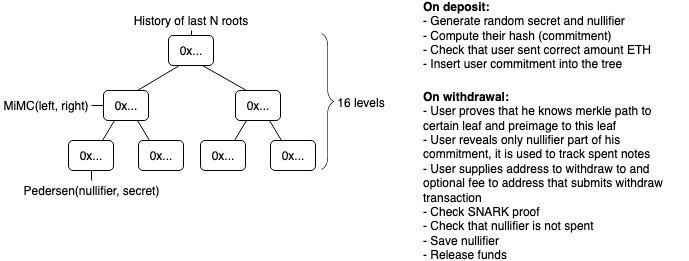

# Tornado Cash Privacy Solution 

Tornado Cash is a non-custodial Ethereum and ERC20 privacy solution based on zkSNARKs. It improves transaction privacy by breaking the on-chain link between recipient and destination addresses. It uses a smart contract that accepts ETH deposits that can be withdrawn by a different address. Whenever ETH is withdrawn by the new address, there is no way to link the withdrawal to the deposit, ensuring complete privacy.

To make a deposit user generates a secret and sends its hash (called a commitment) along with the deposit amount to the Tornado smart contract. The contract accepts the deposit and adds the commitment to its list of deposits.

Later, the user decides to make a withdrawal. In order to do that, the user should provide a proof that he or she possesses a secret to an unspent commitment from the smart contract’s list of deposits. zkSnark technology allows that to happen without revealing which exact deposit corresponds to this secret. The smart contract will check the proof, and transfer deposited funds to the address specified for withdrawal. An external observer will be unable to determine which deposit this withdrawal came from.

You can read more about it in [this medium article](https://medium.com/@tornado.cash.mixer/introducing-private-transactions-on-ethereum-now-42ee915babe0)

## Specs
- Deposit gas const: 1088354 (43381 + 50859 * tree_depth)
- Withdraw gas cost: 301233
- Circuit Constraints = 28271 (1869 + 1325 * tree_depth)
- Circuit Proof time = 10213ms (1071 + 347 * tree_depth)
- Serverless

## Was it audited?

Tornado.cash protocols, circuits, and smart contracts were audited by a group of experts from [ABDK Consulting](https://www.abdk.consulting), specializing in zero knowledge, cryptography, and smart contracts.

During the audit no critical issues were found and all outstanding issues were fixed. The results can be found here:

* Cryptographic review https://tornado.cash/Tornado_cryptographic_review.pdf
* Smart contract audit https://tornado.cash/Tornado_solidity_audit.pdf
* Zk-SNARK circuits audit https://tornado.cash/Tornado_circuit_audit.pdf

Underlying circomlib dependency is currently being audited, and the team already published most of the fixes for found issues

## Requirements
1. `node v11.15.0`
2. `npm install -g npx`

## Usage

You can see example usage in cli.js, it works both in console and in browser.

1. `npm install`
1. `cp .env.example .env`
1. `npm run build` - this may take 10 minutes or more
1. `npx ganache-cli`
1. `npm run test` - optionally runs tests. It may fail on the first try, just run it again.

Use browser version on Kovan:

1. `vi .env` - add your Kovan private key to deploy contracts
1. `npm run migrate`
1. `npx http-server` - serve current dir, you can use any other static http server
1. Open `localhost:8080`

Use with command line version with Ganache:
### ETHTornado
1. `npm run migrate:dev`
1. `./cli.js deposit`
1. `./cli.js withdraw <note from previous step> <destination eth address>`
1. `./cli.js balance <destination eth address>`

### ERC20Tornado
1. `npm run migrate:dev`
1. `./cli.js depositErc20`
1. `./cli.js withdrawErc20 <note from previous step> <destination eth address> <relayer eth address>`
1. `./cli.js balanceErc20 <destination eth address> <relayer eth address>`

If you want, you can point the app to existing tornado contracts on Mainnet or Kovan. It should work without any problems

## Deploy ETH Tornado Cash
1. `cp .env.example .env`
1. Tune all necessary params
1. `npx truffle migrate --network kovan --reset --f 2 --to 4`

## Deploy ERC20 Tornado Cash
1. `cp .env.example .env`
1. Tune all necessary params
1. `npx truffle migrate --network kovan --reset --f 2 --to 3`
1. `npx truffle migrate --network kovan --reset --f 5`

**Note**. If you want to reuse the same verifier for all the instances, then after you deployed one of the instances you should only run 4th or 5th migration for ETH or ERC20 contracts respectively (`--f 4 --to 4` or `--f 5`).

## Credits

Special thanks to @barryWhiteHat and @kobigurk for valuable input,
and to @jbaylina for awesome [Circom](https://github.com/iden3/circom) & [Websnark](https://github.com/iden3/websnark) framework
